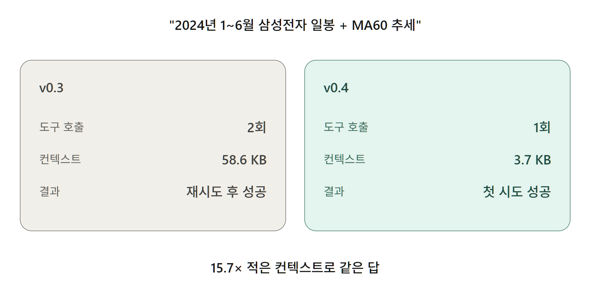

<p align="right">
  <strong>English</strong> · <a href="README.md">한국어</a>
</p>

# mcp-lsopenapi

[](https://www.nuget.org/packages/RedoxNet.Mcp.LsOpenApi/)
[](https://www.nuget.org/packages/RedoxNet.LsOpenApi.Core/)
[](https://github.com/redoxnet/mcp-lsopenapi/actions/workflows/ci.yml)
[](LICENSE)

MCP server for **LS증권 OpenAPI** — exposes Korean stock market data as MCP tools so AI assistants can query quotes, charts, and indicators in natural language.

> v1.x.x is **read-only Korean stock market data**. Realtime feeds, accounts/balances, and orders are scheduled for later releases.

## Disclaimer

This is an **unofficial third-party MCP server**. It is not affiliated with, endorsed by, or sponsored by LS Securities Co., Ltd. (LS증권). "LS증권" and related marks belong to their respective owners.

This tool provides **market data access for informational purposes only**. It does not constitute investment advice or a solicitation to trade. Trading carries risk, including loss of principal. All trading decisions and any resulting gains or losses are solely the user's responsibility.

When using the API, please review the [LS OpenAPI usage guide](https://openapi.ls-sec.co.kr/howto-use) and comply with the Terms of Service available via the "이용약관" link in the site footer.

## Packages

| Package | Type | Purpose |
| --- | --- | --- |
| `RedoxNet.LsOpenApi.Core` | Library | SDK: auth (OAuth2 client_credentials), HTTP client, TR catalog, indicators. |
| `RedoxNet.Mcp.LsOpenApi` | dotnet tool | MCP server over stdio. |
| `RedoxNet.LsOpenApi.Core.Catalog.Builder` | Dev tool | Scrapes the LS docs site to (re)generate the embedded TR catalog. Not shipped. |

## ⚡ v0.4 — Same question, 16× less context



Asking the same model (`claude-sonnet-4-6`) *"Samsung Electronics daily chart for 2024 Jan~Jun, plus MA60 trend within that range"*, v0.3 needed two tool calls to populate MA60 in the narrow window — first a 3-month padding attempt, then a retry with `count=190` after the model noticed the padding wasn't enough.

v0.4 finishes in a single call: the model picks `with_warmup=true` on its first try. Display window (60 bars) and analytical window (300 bars) are separated so long-period indicators all populate, and the summary-first response shape keeps 60 raw OHLCV rows out of the model's context entirely.

Full 7-turn analysis → [docs/case-studies/v0.4.0-token-efficiency.md](docs/case-studies/v0.4.0-token-efficiency.md)

## Quick start

`dnx` fetches the latest published version from NuGet on every launch — no separate install step. Wire it into your MCP host:

### Claude Desktop / Claude Code

`claude_desktop_config.json` (Claude Desktop) or `.mcp.json` at your workspace root (Claude Code):

```jsonc
{
  "mcpServers": {
    "lsopenapi": {
      "command": "dnx",
      "args": ["RedoxNet.Mcp.LsOpenApi", "--yes"],
      "env": {
        "LS_APPKEY": "...",
        "LS_APPSECRETKEY": "...",
        "LS_MARKET": "virtual"  // "virtual" (paper) or "real" (live)
      }
    }
  }
}
```

### Codex CLI

`%USERPROFILE%\.codex\config.toml` (Windows) or `~/.codex/config.toml` (macOS / Linux):

```toml
[mcp_servers.lsopenapi]
command = "dnx"
args = ["RedoxNet.Mcp.LsOpenApi", "--yes"]

[mcp_servers.lsopenapi.env]
LS_APPKEY = "..."
LS_APPSECRETKEY = "..."
LS_MARKET = "virtual"  # "virtual" (paper) or "real" (live)
```

### VS Code (`mcp.json`)

Workspace `.vscode/mcp.json`:

```jsonc
{
  "servers": {
    "lsopenapi": {
      "type": "stdio",
      "command": "dnx",
      "args": ["RedoxNet.Mcp.LsOpenApi", "--yes"],
      "env": {
        "LS_APPKEY": "...",
        "LS_APPSECRETKEY": "...",
        "LS_MARKET": "virtual"  // "virtual" (paper) or "real" (live)
      }
    }
  }
}
```

## Getting an API Key

You need an **AppKey** and **AppSecretKey** pair issued by LS Securities to use this MCP server.

### Prerequisites

- **LS Securities account** — Open via mobile app, online, or branch office. Additional permissions (overseas equities, derivatives, etc.) may require separate applications.
- LS Securities home-trading ID.

### Issuance Steps

1. Log in to the [LS OpenAPI Portal](https://openapi.ls-sec.co.kr/) with your LS Securities ID.
2. Navigate to **OpenAPI 신청 (OpenAPI Application)** → agree to the terms → submit application.
3. After approval, find your **AppKey** and **AppSecretKey** under **MY > API Key 관리 (API Key Management)**.
   - The **AppSecretKey is shown only once** at issuance — store it in a password manager (1Password, Bitwarden, etc.) immediately.
4. New users are encouraged to start with the **paper trading environment** (`LS_MARKET=virtual`). Live trading (`real`) may require additional registration.

### Security Notes

- Never commit the AppSecretKey to git or share it in chat transcripts. Store it in GitHub Secrets for CI workflows, or in your machine's environment variables for local use.
- If you suspect a leak, **regenerate the key** on the LS OpenAPI portal immediately to invalidate the old one.
- Access tokens issued by the OAuth endpoint are valid for 24 hours; this package refreshes them automatically.

For more details from LS, see the [official usage guide](https://openapi.ls-sec.co.kr/howto-use) (Korean only).

## Environment variables

| Name | Required | Description |
| --- | --- | --- |
| `LS_APPKEY` | yes | LS OpenAPI app key. |
| `LS_APPSECRETKEY` | yes | LS OpenAPI app secret key. |
| `LS_MARKET` | no | `real` or `virtual` (default `virtual`). |
| `LS_BASEURL` | no | Override REST base URL (rarely needed). |

Tokens are cached at:
- Windows: `%LOCALAPPDATA%\RedoxNet\LsOpenApi\token.db`
- Linux/macOS: `~/.local/share/redoxnet/lsopenapi/token.db`

The cache is a SQLite database (WAL mode). Cache keys are `SHA256(appkey):market`, so the raw app key never lives on disk. Tokens auto-refresh 5 minutes before expiry.

## Credential handling policy

This server accepts `LS_APPKEY` / `LS_APPSECRETKEY` **only through environment variables**. By design, **no credential is ever requested through chat, tool arguments, or MCP elicitation** — any path the model could observe. The expectation is that the host (Claude Desktop, AssistStudio, etc.) reads the secrets from the OS environment or its own credential store and injects them into the child process.

- **No plaintext on disk.** The token cache stores only `SHA256(appkey):market`; the raw app key and secret never leave process memory.
- **Not surfaced in logs, errors, or tool responses.** Diagnostic output shows `****` plus the last four characters of the app key only; the secret key is never logged in any form.
- **Auth errors from LS (e.g. `IGW00121`)** are converted to [`LsAuthException`](src/RedoxNet.LsOpenApi.Core/Auth/LsAuthException.cs) and surface in the tool response's `error` field only — the credentials you passed in are never echoed back.

This is the strictest reading of the MCP spec's guidance that ["Servers MUST NOT use elicitation to request sensitive information"](https://modelcontextprotocol.io/specification/2025-06-18/client/elicitation#security-considerations).

## Example Workflows

#### 1. Automated Daily Signal Report

Schedule an end-of-day analysis for your watchlist and deliver it to your messenger:

```
Scheduler (e.g. Mcp.Runner) → invokes the LLM
  → ls_get_chart(shcode, period_type="day,week,month", indicators=["ma:5","ma:20","ma:60"])
  → LLM evaluates context.bullish_alignment, divergence_from_ma, etc.
  → Messenger MCP (e.g. Mcp.Outbox) delivers a KakaoTalk/Slack report
```

#### 2. Natural-Language Quote Lookup

```
User: "Show me Samsung Electronics' current price and order book"
  → ls_get_quote(shcode="005930")
  → Returns latest price + 10-level bid/ask
```

#### 3. Indicator-Driven Analysis Dialog

```
User: "Has KODEX AI Power Infrastructure ETF hit a sell signal on its 12-period MA?"
  → ls_get_chart(shcode="490090", period_type="day,week,month",
                 indicators=["ma:12","ma:60"])
  → LLM reasons across day/week/month timeframes using the context block
  → "Monthly view: still in buy zone. Daily view: price approaching 12-MA
     with surging volume — short-term caution warranted."
```

#### 4. Interactive Charts

Pass `include_chart: true` to receive a Plotly v5 JSON spec in the response. Clients that embed Plotly.js (e.g. [AssistStudio](https://github.com/fieldcure/fieldcure-assiststudio)) render inline charts; other clients fall back to the structured `candles`/`indicators`/`context` payload.

## Tools

### Meta

| Tool | Purpose |
| --- | --- |
| `ls_search_tr` | Search the embedded TR catalog by Korean/English keyword. |
| `ls_describe_tr` | Full input/output schema for one TR code. |
| `ls_call_tr` | Invoke any TR with a caller-supplied `in_block` JSON object. |

### Semantic (market data)

| Tool | TR | Purpose |
| --- | --- | --- |
| `ls_get_quote` | `t1101` | Current price + 10-level order book for a single Korean stock. |
| `ls_get_multi_quote` | `t8407` | Compact price snapshot for **up to 50 stocks in one call** — price/OHLC/volume/best ask·bid/총잔량/체결강도. Use for side-by-side comparison or watchlists. |
| `ls_get_top_stocks` | `t1441` / `t1444` / `t1452` / `t1463` / `t1466` | Market-wide screeners — top gainers/losers/unchanged, market cap, volume, trading value, and volume surges. |
| `ls_get_stock_info` | `t1102` | Company profile + fundamentals: PER/PBR/EPS, quarterly financials and growth rates, 52-week + YTD ranges, top-5 buy/sell brokerages, foreign-investor activity, status flags (SPAC/관리종목). |
| `ls_get_chart` | `t8410` / `t8412` / `t1301` | OHLCV charts (day/week/month/year/min/tick), optional indicators (SMA, EMA, RSI, MACD, Bollinger), token-efficient `summary` + `dataset_id`, **multi-timeframe in one call** (`period_type: "day,week,month"`). Raw bars are returned only with `output_mode: "export"`. |
| `ls_add_indicator` | process-local handle cache + chart TR | Add an indicator to a `dataset_id` and return the updated `summary` / chart spec. Example: "add MA200 too". |
| `ls_reframe_chart` | process-local handle cache + chart TR | Re-query the same `dataset_id` symbol with a different period/count and update the handle. Example: "switch this to daily for the last 6 months". |
| `ls_search_stock` | `t8436` | Find KOSPI/KOSDAQ codes by name fragment; surfaces SPAC + 관리종목 flags and an `instrument` filter (`all` / `stock` / `etf`). |
| `ls_get_etf_info` | `t1901` | ETF/ETN-specific snapshot — NAV, tracking-index value, premium/discount (괴리율), AUM, up to 5 liquidity providers, 52-week + year ranges, related futures. |
| `ls_get_etf_holdings` | `t1904` | ETF PDF (portfolio deposit file / 구성종목) — per-holding weight, valuation, market cap, plus an ETF summary (NAV/AUM/cash). Heterogeneous holdings (bonds, cash) pass through verbatim. |

### `ls_get_chart` token-efficient payloads

By default, `ls_get_chart` does not place raw OHLCV arrays in the model context. It returns a follow-up `dataset_id`, a compact model-facing `summary`, and the existing `context` block. Raw `candles` and full `indicators` arrays are returned only when the caller explicitly uses `output_mode: "export"` for table/raw/CSV-style requests.

`output_mode`:

- `display` — chart rendering. Text contains `summary`; Plotly spec goes to `structuredContent.chart`.
- `analyze` — default model reasoning mode. Returns `summary` + `context`, no raw bars.
- `export` — returns raw OHLCV/indicator arrays. Token-expensive; use only for explicit raw data requests.
- `reference` — returns `dataset_id` and metadata only for follow-up tool calls.

`summary` includes latest price, period returns, moving-average snapshots, MA60 deviation and slope (a least-squares fit over the MA), drawdown from peak, and a bounded ZigZag key-turn list (`key_turns`). Each turn carries its peak/trough kind, percent change from the previous turn, and a confirmed/tentative flag (`is_confirmed`) — the trailing turn is the in-progress swing's provisional endpoint, not yet reversed past the threshold.

**Warm-up policy and `summary.coverage`** — `summary` is computed over a deeper warm-up window than the display window, so long moving averages, slope, and 1-year return stay populated even when `count` is small. The default policy is "no `from` → auto warm-up; explicit `from` → skip warm-up"; the `with_warmup` parameter overrides it:

| Intent | Call | Behavior |
|---|---|---|
| "Recent picture" | omit `from` | Warm-up applied automatically |
| "Just this window" | explicit `from` | Warm-up skipped |
| "Trends inside this window" | explicit `from` + `with_warmup=true` | Warm-up forced |
| "Fastest raw read" | `with_warmup=false` | Warm-up skipped (long indicators may be null) |

`summary.coverage` is present on every response so the model can explain which indicators are null and why. It carries a `warmup_applied` flag, `analytical_bar_count`/`display_bar_count`, and a `status` map where each indicator is one of `ok`/`insufficient_data`/`disabled`. When something is insufficient, `note` carries a one-line hint such as "Narrow window — re-run with `with_warmup=true` or remove the date range to populate them."

The `context` block keeps the existing pre-computed analytics:

- `divergence_from_ma` — latest close vs each `ma:N` / `ema:N` indicator, as a percent.
- `volume.{latest,avg_20,ratio_20,avg_60,ratio_60}` — volume vs trailing averages.
- `drawdown.{period_high,period_high_date,current,pct}` — distance from the period high.
- `ma_trend` — direction of each MA over the last 5 bars (`"up"` / `"down"` / `"flat"`).
- `bullish_alignment` — `true` when shorter-period MAs sit above longer-period MAs.

### Multi-timeframe in one call

Pass a comma-separated `period_type` and the response wraps a `frames[]` array, one compact entry per timeframe. Each frame carries its own `summary` / `context`; use `output_mode: "export"` only when raw bars are needed:

```jsonc
// ls_get_chart shcode=005930 period_type="day,week,month" indicators=["ma:5","ma:20","ma:60"]
{
  "shcode": "005930",
  "output_mode": "analyze",
  "dataset_id": "ds_a8f3...",
  "period_types": ["day", "week", "month"],
  "frames": [
    { "period_type": "day",   "tr_cd": "t8410", "count": 60, "summary": {...}, "context": {...} },
    { "period_type": "week",  "tr_cd": "t8410", "count": 60, "summary": {...}, "context": {...} },
    { "period_type": "month", "tr_cd": "t8410", "count": 60, "summary": {...}, "context": {...} }
  ]
}
```

A single `period_type` keeps the flat shape (`summary`, `context`, `dataset_id` at top level).

### Rendering charts (`include_chart: true`)

Pass `include_chart: true` or `output_mode: "display"` and the response carries a Plotly v5 JSON spec under `structuredContent.chart`. The spec is a UI side-channel and is not duplicated into the model-facing text. The server emits the spec only — no server-side image rendering, no charting library dependency.

```jsonc
// ls_get_chart shcode=005930 period_type=day count=60 indicators=["ma:5","ma:20"] include_chart=true
{
  "shcode": "005930",
  "period_type": "day",
  "output_mode": "display",
  "dataset_id": "ds_a8f3...",
  "summary": {...},
  "context": {...},
  "chart_available": true
}

// structuredContent
{
  "chart": {
    "type": "plotly",
    "version": "5",
    "spec": {
      "data": [
        { "type": "candlestick", "name": "OHLC",   "x": [...], "open": [...], "high": [...], "low": [...], "close": [...], "increasing": { "line": { "color": "#E74C3C" } }, "decreasing": { "line": { "color": "#3498DB" } }, "yaxis": "y" },
        { "type": "scatter",     "name": "MA:5",   "x": [...], "y": [...], "mode": "lines", "line": { "color": "#F39C12" }, "yaxis": "y" },
        { "type": "scatter",     "name": "MA:20",  "x": [...], "y": [...], "mode": "lines", "line": { "color": "#27AE60" }, "yaxis": "y" },
        { "type": "bar",         "name": "Volume", "x": [...], "y": [...], "marker": { "color": ["#E74C3C", "#3498DB", ...] }, "yaxis": "y2" }
      ],
      "layout": {
        "title": { "text": "005930 — 일봉" },
        "xaxis": { "type": "category", "rangeslider": { "visible": false } },
        "yaxis":  { "title": { "text": "Price"  }, "domain": [0.3, 1.0] },
        "yaxis2": { "title": { "text": "Volume" }, "domain": [0.0, 0.25] },
        "hovermode": "x unified",
        "showlegend": true
      }
    }
  }
}
```

Korean broker convention: rising candles/bars are red (`#E74C3C`), falling are blue (`#3498DB`). This is the opposite of the US/European convention where green indicates rising and red falling.

Indicator handling in the chart:
- `ma:N`, `ema:N`, `bb:N,SD` → drawn as overlays on the price subplot.
- `rsi:N`, `macd:F,S,Sig` → available for computation but **not** drawn (they need their own subplot scale; future enhancement). Full series are returned in text only with `output_mode: "export"`.

Minimal HTML snippet to render the spec with Plotly.js:

```html
<!DOCTYPE html>
<html>
<head>
  <script src="https://cdn.plot.ly/plotly-2.35.2.min.js"></script>
</head>
<body>
  <div id="chart" style="width: 900px; height: 500px;"></div>
  <script>
    // `structuredContent` here is the UI side-channel returned by ls_get_chart.
    const { data, layout } = structuredContent.chart.spec;
    Plotly.newPlot("chart", data, layout, { responsive: true });
  </script>
</body>
</html>
```

Clients that don't embed Plotly.js can ignore `structuredContent.chart` — the text `summary` / `context` payload remains the model-facing source of truth.

### Indicator specs (for `ls_get_chart`)

| Spec | Effect |
| --- | --- |
| `ma:N` | Simple moving average over N periods. |
| `ema:N` | Exponential moving average. |
| `rsi:N` | Relative Strength Index. |
| `macd:F,S,Sig` | MACD (fast/slow/signal). Returns `.macd`, `.signal`, `.histogram`. |
| `bb:N,SD` | Bollinger Bands. Returns `.lower`, `.middle`, `.upper`. |

## Building from source

```bash
dotnet restore mcp-lsopenapi.slnx
dotnet build mcp-lsopenapi.slnx -c Release
dotnet test mcp-lsopenapi.slnx -c Release
```

Local invocation:
```bash
dotnet run --project src/RedoxNet.Mcp.LsOpenApi --framework net8.0
```

## Status

- ✅ M1 — Core scaffold + auth (OAuth2 client_credentials, SQLite WAL token cache, secret masking).
- ✅ M2 — Embedded TR catalog with 16 testbed-verified seed entries (`t1101`, `t1102`, `t1441`, `t1444`, `t1452`, `t1463`, `t1466`, `t8407`, `t8410`, `t8412`, `t1301`, `t8430`, `t8436`, `t9945`, `t1901`, `t1904`).
- ✅ M3 — TR execution (`LsApiClient.CallTrAsync`) with Polly retries, per-TR rate limiter, header + body continuation modes.
- ✅ M4 — MCP stdio server with 3 meta tools (`ls_search_tr`, `ls_describe_tr`, `ls_call_tr`).
- ✅ M5 — 8 semantic tools: `ls_get_quote`, `ls_get_multi_quote`, `ls_get_top_stocks`, `ls_get_stock_info`, `ls_get_chart` (+ indicators, context metadata, multi-timeframe, Plotly v5 spec via `include_chart`), `ls_search_stock`, **`ls_get_etf_info`, `ls_get_etf_holdings`**.
- ✅ Live verified against the LS virtual server (v0.2.0).
- ⏳ v2.0 — Realtime (WebSocket), accounts/balances, orders.

## License

MIT.
