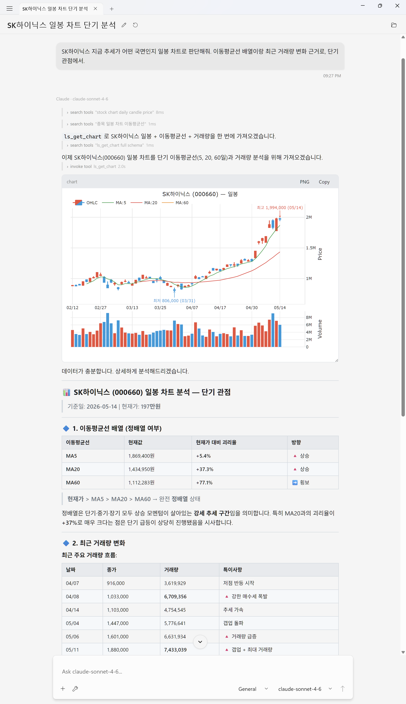
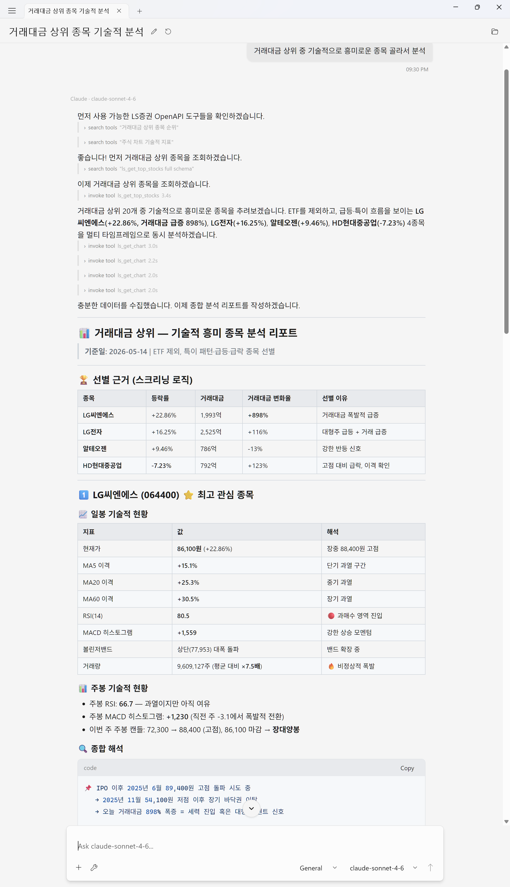

<p align="right">
  <strong>한글</strong> · <a href="README.en.md">English</a>
</p>

# mcp-lsopenapi

[](https://www.nuget.org/packages/RedoxNet.Mcp.LsOpenApi/)
[](https://www.nuget.org/packages/RedoxNet.LsOpenApi.Core/)
[](https://github.com/redoxnet/mcp-lsopenapi/actions/workflows/ci.yml)
[](LICENSE)

## AI에게 시세·차트·내 포트폴리오를 물어보세요.

Claude·ChatGPT·Copilot 같은 AI 비서에 **LS증권 OpenAPI**를 붙입니다. 시세·차트·기업정보·ETF·시장 스크리너·지수/업종/테마 컨텍스트, 그리고 내 보유 종목·관심종목까지 — 평소 쓰던 대화창에서 자연어로 묻고 받습니다.

> *"오늘 코스피 어땠어? 강한 업종은?"*
> *"SK하이닉스 일봉 차트 보여주고 추세 봐줘"*
> *"한투에서 삼성전자 64주 평단 21.5만에 샀어"*
> *"내 보유 중 2차전지 테마만 모아봐"*
> *"포트폴리오 백업해줘"*

설정 한 번이면 됩니다. 종목 코드를 외울 필요도, HTS를 따로 띄울 필요도 없습니다.

대화창에 맞게 가볍게 답합니다. 차트·지수 시계열·보유종목처럼 커지기 쉬운 응답은 요약 우선 형태로 보내고, 필요한 경우에만 원본 데이터로 이어가도록 설계했습니다. 그래서 긴 차트 분석이나 스크리닝 대화도 불필요한 토큰을 덜 쓰고 이어갈 수 있습니다.

> 개발자용 기술 문서(환경 변수, 자격증명 정책, 도구 시그니처, 상세 스키마, SDK·빌드)는 [영문 README](README.en.md)에 있습니다.

---

## 이런 질문에 답합니다

도구 이름이 아니라 *"어떤 질문에 답할 수 있는가"* 로 묶었습니다.

### 시세 / 호가
> *"삼성전자 지금 얼마야?"* · *"카카오 호가창 보여줘"* · *"내 관심종목 10개 가격 한번에 비교"*

단일 종목 현재가와 10단계 호가, 또는 최대 50종목 일괄 비교.

### 차트 / 기술적 분석
> *"SK하이닉스 일·주·월봉 같이 보여줘"* · *"이동평균선이랑 RSI 그려줘"* · *"여기에 MA200도 추가해줘"*

일·주·월·년·분·틱 차트, 이동평균·RSI·MACD·볼린저밴드 같은 기술 지표, 변곡점·MA 정렬·고점 대비 낙폭 같은 사전 계산된 분석. 추가 지표나 기간 변경은 후속 대화에서 그대로 이어집니다.

### 종목 검색 / 기업 정보
> *"카카오 종목코드 뭐야?"* · *"바이오 ETF 알려줘"* · *"삼성전자 PER이랑 분기별 매출 추이"*

KOSPI/KOSDAQ 종목명 부분 검색, 일반주식/ETF 필터, PER/PBR/EPS·분기 재무·52주 가격 범위·상위 거래원·외국인 보유, SPAC·관리종목 플래그.

### ETF 분석
> *"KODEX 200 NAV랑 괴리율 보여줘"* · *"TIGER 미국나스닥100 구성종목 비중 상위 10개"*

ETF/ETN 전용 정보(NAV·추적오차율·괴리율·AUM·LP), 구성종목(PDF) 비중순 정렬과 상위 N개 제한.

### 시장 스크리닝
> *"오늘 상승률 상위 10개"* · *"거래대금 상위 + 시총 1조 이상"* · *"PER 낮은 종목 30개"* · *"오늘 외인 매수 상위"*

등락률·시총·거래량·거래대금 상위, 거래 급증, 펀더멘털 랭킹(PER/PBR/ROE 등), 투자자 수급, 신고/신저가, 공매도 추이, 증권사 투자의견, 관리·매매정지 종목 — 가격·거래량 필터링과 함께.

### 지수 / 업종 / 테마 컨텍스트
> *"오늘 코스피"* · *"강한 업종은?"* · *"2차전지 테마 종목 비교"* · *"삼성전자가 속한 테마"* · *"나스닥·환율 어때?"*

국내 지수 단건·시계열 조회, 해외 지수·환율·선물, 업종 등락률 랭킹, 업종/테마 안의 종목 일괄 시세, 종목별 테마 역조회. 키워드가 모호하면 후보를 보여주고 되묻습니다.

### 프로그램매매 / 기관 수급
> *"오늘 프로그램매매 어땠어?"* · *"프로그램이 순매수한 종목 상위"* · *"삼성전자 프로그램 수급 추이"* · *"삼성전자 기관이 매집 중인지 분석해줘"*

시장 전체 프로그램매매(차익·비차익) 흐름을 분 단위·일 단위로, 종목별 프로그램 순매수 랭킹(시가총액 대비 비중으로 정규화), 개별 종목의 프로그램 수급 추이까지 — 모두 인라인 차트와 함께. 한 종목의 프로그램 발자국을 매집·분산·churn으로 판정하는 footprint 분석도.

### 로컬 포트폴리오 / 관심종목 / 백업·복원
> *"한투에 삼성전자 10주 6.8만 샀어"* · *"5주 더 7.5만에 추가 매수"* · *"내 평가손익 보여줘"* · *"관심종목에 NAVER 추가"* · *"포트폴리오 백업해줘"*

여러 증권사 계좌의 보유 종목·매수/매도 기록(가중평균 평단 자동 계산), 액면분할·무상증자 일괄 반영, 계좌별 + 통합 평가손익. 그룹별 관심종목과 관심 테마 추적, 단일 JSON 백업·복원. 내 보유 종목과 테마/업종을 교차한 필터(*"내 보유 중 2차전지 테마"*)도 한 번에.

---

## 활용 사례

### 차트 + 추세 설명을 한 번에
> *"SK하이닉스 일봉 차트 보여주고 추세 정렬 봐줘"*

AI가 일봉을 불러와 인라인 차트로 띄우고, 이동평균선 배열·거래량·고점 대비 낙폭을 종합해 *"단기 추세는 살아있지만 60일선 근처 매물대 부담"* 같은 한 문장 진단을 자연어로 풉니다.



### 시장 스크리닝 → 후보 종목 분석까지 한 대화 안에서
> *"거래대금 상위 종목을 기술적으로 분석해줘"*

AI가 거래대금 상위 리스트를 받고, 그 중 관심 종목 한두 개를 골라 일봉·주봉 지표로 후속 분석을 이어갑니다. 검색 결과에서 분석으로 넘어가는 데 별도 화면 전환이 없습니다.



---

## 설치 — 1분 컷

**사전 준비.** `dnx`는 **.NET SDK 10 이상**에 들어 있는 dotnet 도구 실행기입니다. 아직 없으면 [.NET 다운로드](https://dotnet.microsoft.com/download/dotnet/10.0)에서 SDK를 먼저 설치하세요 (Windows/macOS/Linux 모두 지원). 터미널에서 `dnx --help`가 도움말을 출력하면 준비 완료입니다.

LS증권 OpenAPI 키 한 쌍(`AppKey` + `AppSecretKey`)이 필요합니다 — [LS증권 OpenAPI 포털](https://openapi.ls-sec.co.kr/)에서 발급받습니다(모의투자도 동일 절차, 자세한 단계는 [영문 README](README.en.md#getting-an-api-key)).

### Claude Desktop / Claude Code

`claude_desktop_config.json` (Claude Desktop) 또는 워크스페이스 루트의 `.mcp.json` (Claude Code)에 아래 한 덩어리를 붙여 넣고 호스트를 재시작합니다.

```jsonc
{
  "mcpServers": {
    "lsopenapi": {
      "command": "dnx",
      "args": ["RedoxNet.Mcp.LsOpenApi", "--yes"],
      "env": {
        "LS_APPKEY": "...",
        "LS_APPSECRETKEY": "...",
        "LS_MARKET": "real"  // 생략해도 real. 모의투자는 "virtual"
      }
    }
  }
}
```

Codex CLI · VS Code 등 다른 호스트의 설정 예시와 환경 변수 전체 목록은 [영문 README](README.en.md#quick-start)에 있습니다. AssistStudio에서는 차트가 대화창에 인라인으로 렌더링됩니다(v1.1 이상 필요).

---

## 데이터와 보안

- **내 포트폴리오·관심종목은 로컬 디스크에만** 저장됩니다 (`%LOCALAPPDATA%\RedoxNet\LsOpenApi\`). 브로커 계좌 동기화나 외부 송신은 없습니다.
- **시장 데이터와 브로커 계좌에 대해서는 read-only**입니다 — 실주문이나 실계좌 잔고 조회는 하지 않습니다. 보유 종목·관심종목·백업 등 포트폴리오 노트만 사용자가 직접 입력해 로컬 DB/JSON에 기록합니다.
- **자격증명(API 키)은 환경변수로만** 전달받습니다. 채팅·도구 인자·MCP 엘리시테이션 등 모델이 관찰할 수 있는 경로로는 절대 받지 않습니다 — 의도된 보안 설계이며, 상세 정책은 [영문 README](README.en.md#credential-handling-policy)에 있습니다.

---

## 면책 조항

이 프로젝트는 **비공식 third-party MCP 서버**입니다. LS증권(LS Securities Co., Ltd.)과 공식적인 제휴·후원·승인 관계가 없으며, "LS증권" 및 관련 상표는 해당 권리자의 소유입니다.

본 도구는 **정보 제공 목적의 시세·차트 데이터 조회용**입니다. 투자 자문이나 매매 권유가 아니며, 주식 거래에는 원금 손실을 포함한 위험이 따릅니다. 모든 투자 결정과 그에 따른 손익은 전적으로 사용자 본인의 책임입니다.

API 사용 시 [LS증권 OpenAPI 이용 안내](https://openapi.ls-sec.co.kr/howto-use)를 참조하고, 사이트에 표시되는 정식 이용약관을 확인 후 준수하시기 바랍니다. 현재 범위는 **국내주식 중심의 read-only 시장 데이터**(일부 해외 지수·환율·선물 스냅샷 포함) **+ 로컬 포트폴리오 노트**이며, 실시간 시세(WebSocket)·실계좌 조회·주문은 후속 릴리스 예정입니다.

---

## 관련 자료

- 개발자용 기술 문서 — [README.en.md](README.en.md)
- 릴리스 노트 — [Mcp](RELEASENOTES.Mcp.md) · [Core](RELEASENOTES.Core.md)
- 사례 분석 — [좁은 구간에서도 한 번에 끝내는 토큰 효율 분석](docs/case-studies/v0.4.0-token-efficiency.md)
- License — [MIT](LICENSE)
