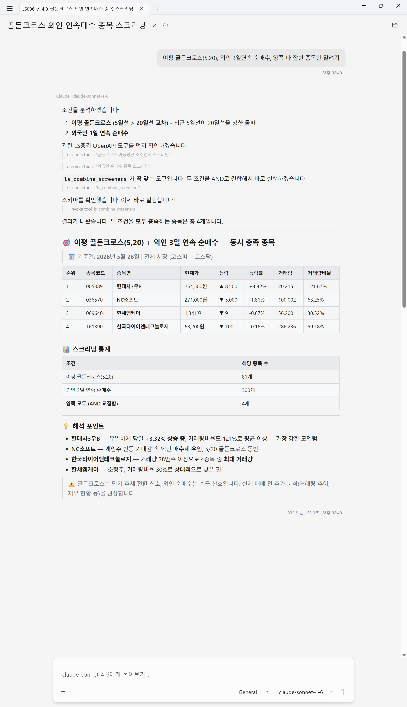
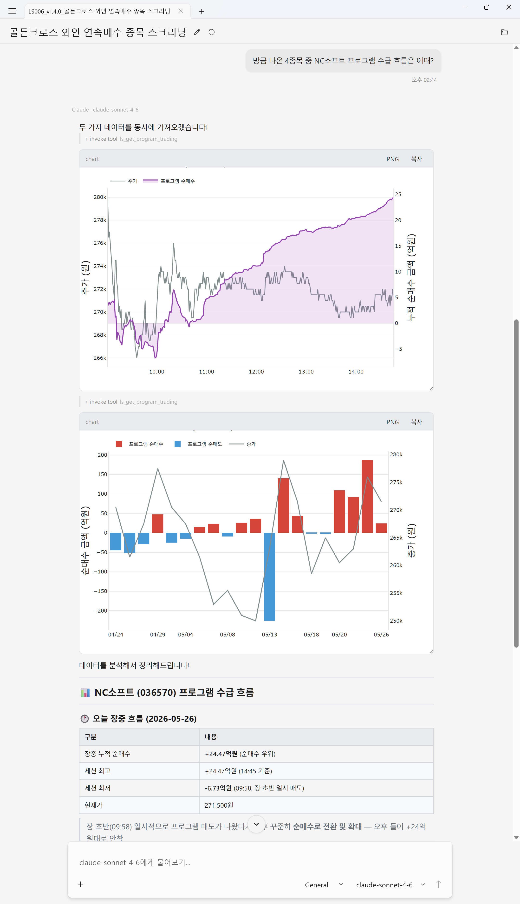

# 활용 사례 모음

AI 비서에 mcp-lsopenapi를 붙였을 때 *"한 대화 안에서 끝나는 것"* 이 어디까지인지를 다섯 가지 케이스로 정리했습니다. 공통 주제는 — **HTS 한 화면으로는 짤 수 없는 흐름이 자연어 한 문장으로 처리되는 순간**.

스크린샷은 모두 [AssistStudio](https://github.com/fieldcure/fieldcure-assiststudio)(v1.1+) 인라인 차트 렌더링 기준입니다. 차트 인라인 표시가 없는 호스트(Claude Desktop / Codex CLI 등)에서는 같은 도구 호출이 텍스트 분석으로 답변됩니다.

---

## 1. 차트 + 추세 설명을 한 번에

> *"SK하이닉스 일봉 차트 보여주고 추세 정렬 봐줘"*

AI가 일봉을 불러와 인라인 차트로 띄우고, 이동평균선 배열·거래량·고점 대비 낙폭을 종합해 *"단기 추세는 살아있지만 60일선 근처 매물대 부담"* 같은 한 문장 진단을 자연어로 풉니다. 차트와 분석 narrative가 같은 응답 안에 들어옵니다 — 차트 따로, 분석 따로가 아닙니다.

핵심 도구: `ls_get_chart` (`summary` + `context` 사전 계산 블록).

---

## 2. 시장 스크리닝 → 후보 종목 분석까지 한 대화 안에서

> *"거래대금 상위 종목을 기술적으로 분석해줘"*

AI가 거래대금 상위 리스트를 받고, 그 중 관심 종목 한두 개를 골라 일봉·주봉 지표로 후속 분석을 이어갑니다. 검색 결과에서 분석으로 넘어가는 데 별도 화면 전환이 없습니다 — 두 단계가 같은 대화의 자연스러운 흐름이 됩니다.

핵심 도구: `ls_get_top_stocks` → `ls_get_chart` (multi-timeframe `period_type="day,week"`).

---

## 3. 두 개의 저장 신호를 합쳐 — HTS 한 화면으로는 못 쓰는 조건 (v1.4)

> *"이평 골든크로스(5,20), 외인 3일연속 순매수, 양쪽 다 잡힌 종목만 알려줘"*

LS의 Q클릭 신호 카탈로그에서 두 개를 골라 한 번에 부르면 교집합(AND) 또는 합집합(OR)으로 한 번에 처리됩니다 — 위 예시는 **골든크로스 81개 × 외인 3일연속 순매수 300개 → 동시 충족 4개**로 좁혀집니다. *스크리닝 통계* 표가 교집합 크기를 명시적으로 보여주고, 각 row의 `signals_matched`로 어느 신호에 함께 잡혔는지가 따라 옵니다.

HTS의 "조건검색"은 보통 한 화면에 한 조건식만 짤 수 있어서 — 두 개의 조건식 결과를 비교하려면 두 화면을 열어 눈으로 교집합을 찾는 작업이 필요합니다. Q-Click + `ls_combine_screeners`는 그 과정을 자연어 한 문장으로 압축합니다.

핵심 도구: `ls_combine_screeners` (mode=and / or, 2~8개 신호).

---

## 4. 한 대화에서 스크리닝 → 프로그램매매 footprint까지 (v1.1)

> *"방금 나온 4종목 중 NC소프트 프로그램 수급 흐름은 어때?"*

[케이스 3]의 Q-Click 결과 후보 중 하나를 골라 그대로 프로그램매매 분석으로 이어갑니다. `ls_get_program_trading scope=stock include_chart=true`가 **분봉(누적 순매수 곡선) + 일봉(매수/매도 분리 막대)** 두 개의 인라인 차트를 띄우고, *"장중 누적 순매수 +24.47억원 (순매수 우위) / 세션 최저 -6.73억원 (09:58, 장 초반 일시 매도)"* 같은 수치를 표로 정리해 — 매집/분산/churn 판정까지 한 화면에 담아냅니다.

HTS의 프로그램매매 화면은 raw 차익/비차익 흐름을 보여주지만, "지금이 매집 국면인지 분산 국면인지"를 판정하지는 않습니다. `ls_analyze_program_flow`는 그 판정을 결정론적으로(매수일 persistence + streak / churn ratio / 강도 / 인트라데이 pace / 가격 coupling) 내려주는 분석 레이어입니다.

핵심 도구: `ls_get_program_trading` (인라인 Plotly 차트) + `ls_analyze_program_flow` (footprint 판정).

---

## 5. 분할 매수 평단 머지 + 액면분할 일괄 반영

> *"한투에 SK하이닉스 10주 21.5만에 샀어"* → *"5주 더 24만에 추가 매수"* → *"100원 액면분할 빠뜨렸어"*

매수 기록을 두 번에 나눠 입력해도 가중평균 평단이 자동으로 다시 계산되고(*22.33만, 총 15주*), 액면분할/무상증자는 한 명령으로 모든 계좌에 일괄 반영됩니다. HTS의 "내 계좌"는 평단만 보여주지 매수/매도 기록을 자유롭게 편집하기 어려운데, 여기서는 자연어로 누적해 쌓아 올리면 됩니다.

> 데이터는 모두 로컬 SQLite(`%LOCALAPPDATA%\RedoxNet\LsOpenApi\portfolio.db`)에만 저장됩니다 — 브로커 계좌 동기화나 외부 송신은 없습니다.

핵심 도구: `ls_holding` (`buy` / `sell` / `corporate_action` 액션 라우터) + `ls_holdings_list`.

---

## 관련 자료

- 토큰 효율 정량 비교 — [v0.4 token efficiency case study](v0.4.0-token-efficiency.md)
- 영문 도구 시그니처·환경변수·SDK 문서 — [README.en.md](../../README.en.md#tools)
- 릴리스 노트 — [Mcp](../../RELEASENOTES.Mcp.md) · [Core](../../RELEASENOTES.Core.md)
