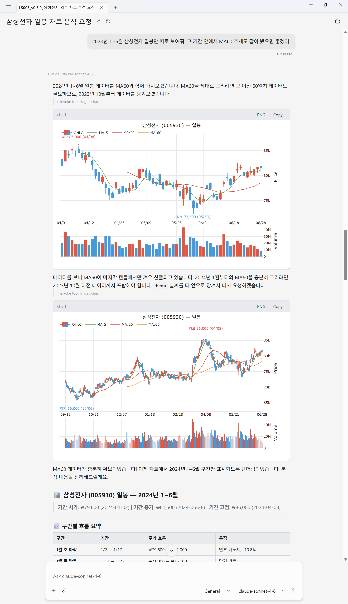
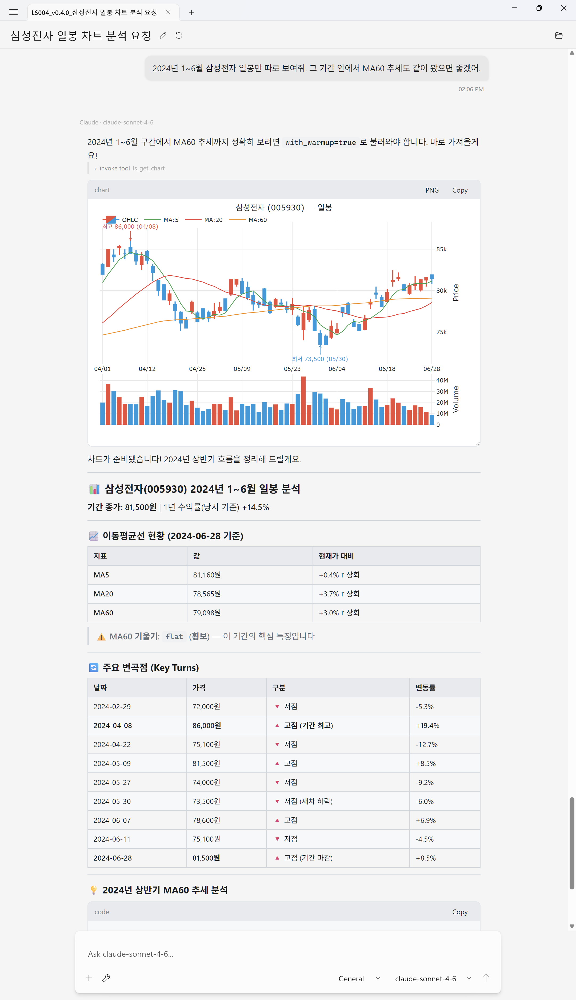

# v0.4 token efficiency — a 7-turn case study

같은 모델(`claude-sonnet-4-6`)에 같은 7개 질문을 v0.3과 v0.4로 던졌을 때 도구 응답 페이로드가 **302 KB → 93 KB (3.2×)** 줄었습니다. 가장 차이가 큰 단일 케이스는 좁은 기간 안에서 long-period MA를 요구하는 시나리오로 **58.6 KB / 2 호출 → 3.7 KB / 1 호출 (15.7×)** 입니다.


---

## Setup

| | v0.3 | v0.4 |
|---|---|---|
| 패키지 | `RedoxNet.Mcp.LsOpenApi@0.3.0` | `RedoxNet.Mcp.LsOpenApi@0.4.0` |
| 모델 | `claude-sonnet-4-6` | (동일) |
| 시장 | `LS_MARKET=virtual` | (동일) |
| 호스트 | AssistStudio (인라인 차트 빌드) | (동일) |
| 세션 파일 | [LS003_v0.3.0...astx](./sessions/LS003_v0.3.0_삼성전자%20일봉%20차트%20분석%20요청.astx) | [LS004_v0.4.0...astx](./sessions/LS004_v0.4.0_삼성전자%20일봉%20차트%20분석%20요청.astx) |
| 메시지 수 | 40 | 38 |
| 도구 호출 수 | 14 | 12 |
| 도구 응답 총합 | 302,365 bytes | 93,419 bytes |

도구 호출 수와 총합에는 AssistStudio가 세션 시작 시 발행하는 `search_tools` discovery probe 2회(MCP 서버 무관)가 포함됩니다 — Methodology 참고.

---

## Hero scenario: narrow window + long MA

> **사용자**: "2024년 1~6월 삼성전자 일봉만 따로 보여줘. 그 기간 안에서 MA60 추세도 같이 봤으면 좋겠어."

좁은 기간(~120 거래일) 안에서 MA60(60일 이동평균)을 보고 싶다는 요구. MA60을 산출하려면 그 이전 60일치 데이터가 추가로 필요합니다.

### v0.3 — 2 호출, 58.6 KB



호출 1: 모델이 직관적으로 3개월 padding 시도.
```json
{ "shcode": "005930", "period_type": "day",
  "from": "20231001", "to": "20240630",
  "indicators": ["ma:5", "ma:20", "ma:60"], "include_chart": true }
```
응답 14,247 chars. MA60이 마지막 캔들에서만 산출됨을 모델이 인지하고 재호출.

호출 2: `count=190`으로 강제 padding.
```json
{ "shcode": "005930", "period_type": "day",
  "count": 190, "to": "20240630",
  "indicators": ["ma:5", "ma:20", "ma:60"], "include_chart": true }
```
응답 44,389 chars. 합계 58,636 chars.

### v0.4 — 1 호출, 3.7 KB



첫 마디부터 다름:
> *"2024년 1~6월 구간에서 MA60 추세까지 정확히 보려면 `with_warmup=true`로 불러와야 합니다."*

```json
{ "shcode": "005930", "period_type": "day",
  "from": "20240101", "to": "20240630",
  "indicators": ["ma:5", "ma:20", "ma:60"],
  "include_chart": true, "output_mode": "display",
  "with_warmup": true }
```

응답 3,733 chars (발췌):
```json
{
  "dataset_id": "ds_33f114a2",
  "summary": {
    "bar_count": 300,
    "date_range": "2023-04-07 ~ 2024-06-28",
    "moving_averages": {
      "MA5": 81160, "MA20": 78565, "MA60": 79098,
      "MA120": 76829, "MA200": 74480
    },
    "ma60_slope": "flat",
    "key_turns": [ /* ... */ ],
    "coverage": {
      "warmup_applied": true,
      "analytical_bar_count": 300,
      "display_bar_count": 60,
      "note": null
    }
  }
}
```

표시는 60바, 분석은 300바로 분리. `candles[]`는 `output_mode="display"`에서 생략.

---

## 네 가지 메커니즘

**1. Summary-first payload.** v0.3 응답은 `candles[]`로 시작 — 모델이 60개 캔들을 직접 읽어 MA·drawdown·divergence를 derive해야 함. v0.4는 사전 계산된 `summary` 블록을 응답 머리에 두고, `output_mode="display"` 기본값은 raw candles를 생략합니다.

**2. `with_warmup` separates analytical from display.** display(60바)와 analytical(300바)을 명시적으로 분리. 모델은 tool description의 가이드에 따라 "narrow window + long-period indicator" 패턴에서 첫 시도에 `with_warmup=true`를 선택합니다.

**3. `dataset_id` + follow-up tools.** "MA200도 추가해줘"는 v0.3에서 `ls_get_chart` 전체 재호출(24K)이지만 v0.4에선 `ls_add_indicator(dataset_id, "ma:200")` 한 번(3.9K). LRU 캐시(16 datasets × 5 MB)가 원본 시리즈를 보관합니다.

**4. `coverage.note` self-correction.** 좁은 윈도우로 호출되면 응답이 직접 *"pass `with_warmup=true` to populate them"* 이라고 안내합니다. 모델이 첫 시도에 잘못된 인자를 골라도 다음 시도에서 교정. Hero 시나리오에서는 이 fallback 경로조차 발동하지 않았습니다 — description 가이드만으로 첫 시도에 적중.

---

## 나머지 6개 질문

수치는 MCP 서버 도구 응답만 (라우터 probe 제외).

| # | 사용자 질문 | v0.3 | v0.4 | Δ |
|---|---|---|---|---|
| 1 | 삼성전자 일봉 + 최근 흐름 | 1 호출, 23,299 | 1 호출, **3,735** | 6.2× |
| 2 | MA200도 같이 그려줘 | 1 호출 (재호출), 24,141 | 1 호출 (`ls_add_indicator`), **3,855** | 6.3× |
| 3 | 주봉 1년치로 다시 | 1 호출 (재호출), 20,617 | 1 호출 (`ls_reframe_chart`), **3,619** | 5.7× |
| 4 | 카카오 월봉 5년 + 변곡점 | 2 호출, 20,910 | 1 호출, **3,474** | 6.0× |
| 5 | SK하이닉스 일·주·월 | 4 호출, 109,230 | 4 호출, **23,231** | 4.7× |
| 6 | 최근 10일 원시 데이터 표 | 1 호출, **2,469** | 1 호출, 4,773 | **0.5×** |
| 7 | 2024년 1~6월 narrow + MA60 | 2 호출, 58,636 | 1 호출, **3,733** | **15.7×** |

**#6의 역전**: `output_mode="export"`도 `summary` 블록을 함께 반환하므로 raw 캔들 10개만 요청한 케이스에서는 v0.4가 ~1.9× 더 큽니다. 절대값 차이는 2.3 KB로 다른 케이스의 절약분에 묻힙니다.

**#5의 4 호출**: 두 버전 다 `period_type="day,week,month"` 통합 호출 1회 + 인라인 차트용 개별 호출 3회. v0.4 통합 호출이 `frames[]`에 raw candles를 빼고 summary만 담아서 50K → 12K로 줄었고, 개별 호출도 19K → 3.6K로 줄었습니다. 인라인 차트 multi-timeframe의 N+1 패턴은 양쪽 다 동일 — 통합 호출이 frame별 chart spec을 `structuredContent`에 묶어 보낼 수 있다면 줄일 여지가 있으나 호스트 측 지원도 필요합니다.

---

## 관찰된 이상 동작 — same-bar duplicate pivots

v0.4 카카오 월봉(SC4)에서 같은 (date, kind) pivot이 중복 emit:

```
[3] 2025-06 peak   71,600  (+97.2%)
[4] 2025-06 trough 41,050  (-42.7%)
[5] 2025-06 peak   71,600  (+74.4%)   ← duplicate
```

원인: 2025-06이 H=71,600 L=41,050의 wide-range bar(74% intrabar)였고, ZigZag의 down-leg 확정 시 `hi` 트래커를 리셋하지 않아 stale 상태로 남음. 다음 bar의 close가 stale `hi` 기준 reversal threshold를 깨면서 같은 peak가 재emit.

같은 index에 *다른 kind*(peak + trough)가 나오는 건 wide-range bar의 정당한 표현 — 한 바가 swing의 고점이자 저점인 경우. 픽스가 잡아야 할 건 같은 (index, kind) 쌍의 중복입니다.

**픽스**: ZigZag confirmation 분기에서 양쪽 트래커를 모두 리셋하도록 수정 + 회귀 테스트 추가. **v0.5.0 동승 예정**.

심각도는 낮습니다 — 모델은 자연어로 무리 없이 풀어 썼고, 분석 결론에 영향을 주지 않습니다.

---

## 직접 재현하기

1. AssistStudio 설치 — Microsoft Store, Product ID `9N09D0QGSTZD`. 인라인 차트는 v1.1+ 필요.
2. LS API key 발급 — [LS증권 OpenAPI 포털](https://openapi.ls-sec.co.kr/).
3. MCP 서버 등록:
   ```json
   {
     "command": "dnx",
     "args": ["RedoxNet.Mcp.LsOpenApi@0.4.0", "--yes"],
     "env": {
       "LS_APPKEY": "...",
       "LS_APPSECRETKEY": "...",
       "LS_MARKET": "virtual"
     }
   }
   ```
   v0.3 재현은 `@0.3.0`.
4. [`sessions/`](./sessions/) 의 `.astx`를 AssistStudio에서 File → Open.
5. 임의 turn에서 Branch 재실행. 시장 데이터는 실시간이라 동일 숫자는 나오지 않지만 호출 패턴과 페이로드 크기는 재현됩니다.

---

## Methodology

도구 응답 바이트 = `conversation.json`의 `Role: "Tool"` 메시지 `Content` 길이 합 (UTF-8 char count). JSON-RPC envelope, assistant 텍스트, tool_use 인자는 제외.

```python
import json, zipfile
with zipfile.ZipFile("LS004.astx") as z:
    conv = json.load(z.open("conversation.json"))
tool_bytes = sum(
    len(m["Content"]) for m in conv["Messages"]
    if m["Role"] == "Tool" and isinstance(m["Content"], str)
)
```

**Setup의 inclusive 수치 vs Per-scenario의 substantive 수치**:

- *Inclusive* (Setup, 302 KB / 93 KB, 14 / 12 calls): 세션의 모든 `Tool` 메시지. AssistStudio가 세션 시작 시 자체 라우터로 발행하는 `search_tools` discovery probe 2회 포함 — v0.3 ~43 KB / v0.4 ~47 KB. v0.4가 약간 큰 이유: 도구가 13개로 늘어 스키마 리스트가 커짐.
- *Substantive* (per-scenario): MCP 서버가 실제 emit한 도구 응답만 (`ls_get_chart`, `ls_add_indicator`, `ls_reframe_chart`, `ls_search_stock`). 라우터 probe 제외. 총합 v0.3 259 KB / v0.4 46 KB = 5.6×.

두 기준 모두 정직한 측정 — inclusive는 호스트가 모델에 흘려보낸 총량, substantive는 MCP 서버 변경이 직접 줄인 양입니다.

`.astx` = `manifest.json` + `conversation.json`을 묶은 zip 아카이브.

---

## 추가 자료

- [`RELEASENOTES.Mcp.md`](../../RELEASENOTES.Mcp.md) — v0.4.0 변경 내역
- [`RELEASENOTES.Core.md`](../../RELEASENOTES.Core.md) — `AnalyticalSummaryBuilder`, `ZigZag`, `IndicatorCoverage` SDK
- [AssistStudio (Microsoft Store)](https://apps.microsoft.com/detail/9N09D0QGSTZD)
